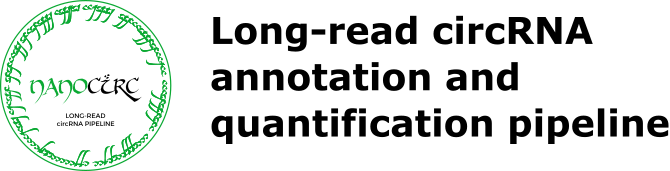
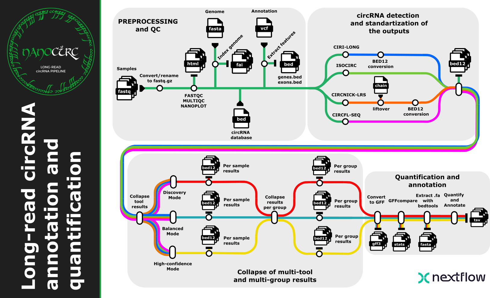

<h1>
  <picture>
    <source media="(prefers-color-scheme: dark)" srcset="docs/images/nanocirc-logo-dark.png">
    
  </picture>
</h1>

[](https://www.nextflow.io/)
[](https://github.com/nf-core/tools/releases/tag/3.5.1)
[](https://sylabs.io/docs/)
[](https://www.docker.com/)

## Introduction

**nanocirc** is a bioinformatics pipeline for the detection and characterisation of circular RNAs (circRNAs) from long-read nanopore sequencing data. It runs up to four detection tools with different algorithms in parallel, converts their outputs to a unified BED12 format, collapses results across different tools and runs with consensus confidence scoring and quantifies them.

The pipeline is designed for researchers who want to maximise circRNA detection sensitivity by combining complementary tools, and to obtain a ranked, confidence-scored list of circRNA candidates supported by multiple independent methods.

## Pipeline overview



The pipeline runs the following steps:

1. **Read QC** - [`FastQC`](https://www.bioinformatics.babraham.ac.uk/projects/fastqc/) and [`NanoPlot`](https://github.com/wdecoster/NanoPlot) for nanopore-specific quality metrics
2. **circRNA detection** (run in parallel):
   - [`isoCirc`](https://github.com/Xinglab/isoCirc)
   - [`CircFL-seq`](https://github.com/yangence/circfull)
   - [`CIRI-long`](https://github.com/bioinfo-biols/CIRI-long)
   - [`circnick-lrs`](https://github.com/dzhang32/circnick)
3. **BED12 conversion** - all tool outputs converted to a unified 12-column BED format
4. **Pairwise comparison** - [`bedtools intersect`](https://bedtools.readthedocs.io/) across all tool pairs with --split for exon boundaries meeting user defined reciprocal overlap fraction (default 0.95)
5. **Hybrid smart merge** - BSJ majority vote across all tools, plus an absolute-coordinate structure vote among exact-BSJ tools; produces four confidence-filtered outputs (discovery, balanced_precision, balanced_recall, high_confidence). Optionally also merges across sequencing runs (`--run_crossrun_merge`, see below)
6. **Confidence scoring** - each circRNA scored on two independent axes: BSJ consensus and isoform structure consensus (each Low/Medium/High)
7. **Quantification** (optional, `--run_quantify`) - remap-based read counting against a discovery catalog: chunked remap-and-classify, overlap-cluster rescue, and targeted/gene-family rescue for hard-to-place loci. The `discovery`/`balanced_recall`/`high_confidence` tiers then get a post-quantification confidence filter that drops low-read, weakly-supported loci
8. **MultiQC** - [`MultiQC`](https://multiqc.info/) aggregated QC report

## Quick start

> [!NOTE]
> If you are new to Nextflow, please refer to [this page](https://nf-co.re/docs/usage/installation) on how to set it up. New to bioinformatics ? See [docs/quickstart.md](docs/quickstart.md) for a simple-language walkthrough (what to install, which files you need, samplesheet/config examples).

### 0. Test your installation

Before running on real data, check that the pipeline and all containers work on your system:

```bash
nextflow run aerusakovich/nanocirc_pipeline -profile test,singularity --outdir test_results/
```

This uses a small provided chr21-only dataset (no samplesheet or reference files needed) and runs the full pipeline end to end, all 4 tools plus quantification. If it finishes with `Pipeline completed successfully`, your setup works. Optionally you can change `singularity` to `docker`.

### 1. Prepare a samplesheet

Create a CSV file listing your samples and their FASTQ paths:

```csv
sample,fastq
SAMPLE1,/path/to/sample1.fastq.gz
SAMPLE2,/path/to/sample2.fastq.gz
```

### 2. Run the pipeline

```bash
nextflow run aerusakovich/nanocirc_pipeline \
    -profile singularity \
    --input     samplesheet.csv \
    --outdir    results/ \
    --fasta     /path/to/genome.fa \
    --gtf       /path/to/annotation.gtf \
    --circrna_db /path/to/circ_db.bed \
    --circnick_species mouse
```

> [!WARNING]
> Provide pipeline parameters via the CLI or a `-params-file`. Custom config files (`-c`) should only be used for resource tuning, not parameters.

For full parameter documentation see [docs/usage.md](docs/usage.md).

## Key parameters

| Parameter                   | Description                                               | Default |
| --------------------------- | --------------------------------------------------------- | ------- |
| `--input`                   | Path to samplesheet CSV                                   | N/A     |
| `--fasta`                   | Reference genome FASTA                                    | N/A     |
| `--gtf`                     | Gene annotation GTF                                       | N/A     |
| `--circrna_db`              | circRNA database BED (required for isoCirc and CIRI-long) | N/A     |
| `--run_isocirc`             | Enable isoCirc                                            | `true`  |
| `--run_circfl`              | Enable CircFL-seq                                         | `true`  |
| `--run_cirilong`            | Enable CIRI-long                                          | `true`  |
| `--run_circnick`            | Enable circnick-lrs                                       | `true`  |
| `--circnick_species`        | Species for circnick-lrs: `mouse` or `human`              | N/A     |
| `--circnick_liftover_chain` | UCSC chain file for coordinate liftover (optional, but required if provided version of genome differs from h19 or m38, otherwise circNICK-lrs results will be incomparable with other tools) | N/A |
| `--circrna_bsj_tolerance`   | BSJ coordinate tolerance for relaxed merge (bp)           | `5`     |
| `--circrna_isoform_overlap` | Min reciprocal spliced-length overlap for isoform scoring | `0.95`  |
| `--run_benchmark_modes`     | Also publish legacy merge variants and all filtered combinations | `false` |
| `--run_crossrun_merge`      | Merge circRNA calls across samples sharing a `group`      | `false` |
| `--crossrun_min_tool_agreement` | Min tool agreement to keep a single-run isoform structure in cross-run merge | `2` |
| `--run_quantify`            | Enable remap-based circRNA quantification                 | `false` |
| `--circrna_confident_min_reads` | Max quantified read count for the discovery/balanced_recall confidence filter | `2` |

## Output

The main outputs are under `<outdir>/circrna/<sample>/`, alongside top-level `qc/` (FastQC + NanoPlot) and `multiqc/`:

```
circrna/
├── <sample>/
│   ├── bed12/                          # Per-tool BED12 files
│   ├── isocirc/                        # isoCirc raw output
│   ├── circfl_seq/                     # CircFL-seq raw output
│   ├── ciri_long/                      # CIRI-long raw output
│   ├── circnick_lrs/                   # circnick-lrs raw output
│   ├── quantify/                       # raw per-locus read counts (--run_quantify)
│   └── merged/                         # Hybrid smart-merge outputs
│       ├── <sample>_discovery.*          # all merged circRNAs (max recall)
│       ├── <sample>_balanced_precision.*  # isocirc_only filter (precision-leaning)
│       ├── <sample>_balanced_recall.*     # consensus algorithm, trusted_only filter (recall-leaning)
│       ├── <sample>_high_confidence.*     # high_only_isocirc filter (max precision)
│       ├── clean/                        # wet-lab-friendly TSV per tier, the main output for downstream analysis
│       ├── annotated/                     # GFF-compared, annotated TSV per tier
│       ├── fasta/                        # circRNA sequences per tier
│       └── gff/                          # GFF3 per tier
├── crossrun/<group>/<tier>/            # cross-sample merge (--run_crossrun_merge)
└── deseq2/                             # DESeq2-ready count matrices (--run_quantify)
```

Each `merged/<sample>_<tier>.*` pair is a BED12 file and a confidence TSV. The confidence TSV includes per-tool flags, isoform overlap fractions, and two independent consensus labels: `bsj_consensus` and `isoform_consensus` (each Low / Medium / High). See [Cross-run merge and quantification](#cross-run-merge-and-quantification) below for `crossrun/` and `deseq2/`.

For full output documentation see [docs/output.md](docs/output.md).

## Confidence scoring

Each merged circRNA is scored on two **independent** axes:

- **`bsj_consensus`** (`Low`/`Medium`/`High`): fraction of active tools detecting this BSJ
- **`isoform_consensus`** (`Low`/`Medium`/`High`): fraction of active tools confirming this exon structure

Both are binned from the percentage of active tools (≤25% → Low, ≤75% → Medium, >75% → High). The two axes are independent: a circRNA can have a well-supported BSJ but uncertain isoform boundaries.

The four output modes filter on these axes:

| Output            | Kept entries                              |
| ----------------- | ----------------------------------------- |
| `discovery`       | All (no filter)                           |
| `balanced_precision` | ≥ Medium on both axes, or Low from IsoCirc |
| `balanced_recall` | ≥ Medium on both, or Low from a trusted tool (CIRI-long/IsoCirc) |
| `high_confidence` | High on **both** axes, or Low from IsoCirc if it meets read support threshold|

> **Note:** Scores reflect agreement among the tools that actually ran. A `High` from 2 tools (both agree) is not equivalent to `High` from 4 tools. The pipeline warns when fewer than 4 tools are active.

## Cross-run merge and quantification

Set `--run_crossrun_merge true` (with a `group` column in the samplesheet) to merge circRNA calls across sequencing runs of the same sample, using the same tiered confidence logic across runs instead of tools. A locus's back-splice junction (BSJ) position and its exon structure are voted on separately: this keeps a well-supported BSJ from being dropped just because different runs reported slightly different exon structures at the same junction. A single-run structure call is kept only if that run's own tool agreement clears `--crossrun_min_tool_agreement`.

Set `--run_quantify true` to add per-locus read counts, either per sample or per group depending on `--run_crossrun_merge`. The `discovery`/`balanced_recall` tiers then go through a confidence filter that drops low-read loci called only by CircNick-LRS; `high_confidence` goes through the same filter but drops low-read IsoCirc-only calls instead. Both use `--circrna_confident_min_reads` as the read-count cutoff. `balanced_precision` is untouched.

When `--run_quantify true` is set, the pipeline also builds a DESeq2-ready count matrix per confidence tier, one wide table with every sample in the run as a column. Each row is one isoform (same BSJ but a different exon structure gets its own row), so multi-isoform loci aren't collapsed. Found in `<outdir>/circrna/deseq2/`:

```
deseq2/
├── deseq2_counts_<tier>.tsv    # isoform x sample raw read counts
├── deseq2_coldata_<tier>.tsv   # sample, group - feed straight to DESeq2's colData
└── deseq2_features_<tier>.tsv # isoform coordinates, exon structure, bsj_id, type
```

`<tier>` is one of `discovery`, `balanced_precision`, `balanced_recall`, `high_confidence`. With `--run_crossrun_merge true`, samples in the same group are quantified against one shared catalog so their rows already line up; samples from different groups (or with cross-run merge off) are unioned across their own catalogs, 0-filled where a sample's own catalog never called that isoform.

See [docs/usage.md](docs/usage.md) and [docs/output.md](docs/output.md) for full details.

## Credits

nanocirc was written by [Anastasia Rusakovich](https://github.com/aerusakovich).

The pipeline builds on the [nf-core](https://nf-co.re) framework and uses containers from [BioContainers](https://biocontainers.pro/) and this pipeline's own patched builds in [containers_circRNA_tools](https://github.com/aerusakovich/containers_circRNA_tools).

## Citations

If you use nanocirc, please cite:

> Rusakovich A, Derrien T*, Blum Y* (*co-last authors). nanocirc: a Nextflow pipeline for long-read circRNA detection and annotation using a consensus multi-tool approach and confidence scoring. Manuscript in preparation.

This pipeline's design and benchmark was motivated by our first benchmark study:

> Rusakovich A, Corre S, Cadieu E, Fraboulet RM, Le Bars V, Galibert MD, Derrien T, Blum Y. Benchmarking circRNA detection tools from long-read sequencing using a data-driven and flexible simulation framework. Peer Community Journal. 2026;6:e27. doi: 10.24072/pcjournal.699.

Please also cite the tools used:

- **isoCirc**: Xin, R., Gao, Y., Gao, Y., Wang, R., Kadash-Edmondson, K. E., Liu, B., Wang, Y., Lin, L., & Xing, Y. (2021). isoCirc catalogs full-length circular RNA isoforms in human transcriptomes. Nature Communications, 12(1), 266. https://doi.org/10.1038/s41467-020-20459-8
- **CircFL-seq**: Liu, Z., Tao, C., Li, S., Du, M., Bai, Y., Hu, X., Li, Y., Chen, J., & Yang, E. (2021). circFL-seq reveals full-length circular RNAs with rolling circular reverse transcription and nanopore sequencing. eLife, 10, e69457. https://doi.org/10.7554/eLife.69457
- **CIRI-long**: Zhang, J., Hou, L., Zuo, Z., Ji, P., Zhang, X., Xue, Y., & Zhao, F. (2021). Comprehensive profiling of circular RNAs with nanopore sequencing and CIRI-long. Nature Biotechnology, 39(7), 836–845. https://doi.org/10.1038/s41587-021-00842-6
- **circnick-lrs**: Rahimi, K., Venø, M. T., Dupont, D. M., & Kjems, J. (2021). Nanopore sequencing of brain-derived full-length circRNAs reveals circRNA-specific exon usage, intron retention and microexons. Nature Communications, 12(1), 4825. https://doi.org/10.1038/s41467-021-24975-z
- **bedtools**: Quinlan, A. R., & Hall, I. M. (2010). BEDTools: A flexible suite of utilities for comparing genomic features. Bioinformatics, 26(6), 841–842. https://doi.org/10.1093/bioinformatics/btq033
- **pybedtools**: Dale, R. K., Pedersen, B. S., & Quinlan, A. R. (2011). Pybedtools: a flexible Python library for manipulating genomic datasets and annotations. Bioinformatics, 27(24), 3423–3424. https://doi.org/10.1093/bioinformatics/btr539
- **UCSC liftOver / Genome Browser**: Kent, W. J., Sugnet, C. W., Furey, T. S., Roskin, K. M., Pringle, T. H., Zahler, A. M., & Haussler, D. (2002). The human genome browser at UCSC. Genome Research, 12(6), 996–1006. https://doi.org/10.1101/gr.229102
- **samtools**: Danecek, P., Bonfield, J. K., Liddle, J., Marshall, J., Ohan, V., Pollard, M. O., Whitwham, A., Keane, T., McCarthy, S. A., Davies, R. M., & Li, H. (2021). Twelve years of SAMtools and BCFtools. GigaScience, 10(2), giab008. https://doi.org/10.1093/gigascience/giab008
- **GffRead / GffCompare**: Pertea, G., & Pertea, M. (2020). GFF Utilities: GffRead and GffCompare. F1000Research, 9, ISCB Comm J-304. https://doi.org/10.12688/f1000research.23297.2
- **AGAT**: Dainat, J. AGAT: Another Gff Analysis Toolkit to handle annotations in any GTF/GFF format. Zenodo. https://doi.org/10.5281/zenodo.3552717
- **minimap2**: Li, H. (2018). Minimap2: pairwise alignment for nucleotide sequences. Bioinformatics, 34(18), 3094–3100. https://doi.org/10.1093/bioinformatics/bty191
- **BLAT**: Kent, W. J. (2002). BLAT-the BLAST-like alignment tool. Genome Research, 12(4), 656–664. https://doi.org/10.1101/gr.229202
- **BWA**: Li, H., & Durbin, R. (2009). Fast and accurate short read alignment with Burrows-Wheeler transform. Bioinformatics, 25(14), 1754–1760. https://doi.org/10.1093/bioinformatics/btp324
- **FastQC**: Andrews, S. (2010). FastQC: a quality control tool for high throughput sequence data.
- **NanoPlot**: De Coster, W., D’Hert, S., Schultz, D. T., Cruts, M., & Van Broeckhoven, C. (2018). NanoPack: Visualizing and processing long-read sequencing data. Bioinformatics, 34(15), 2666–2669. https://doi.org/10.1093/bioinformatics/bty149
- **MultiQC**: Ewels, P., Magnusson, M., Lundin, S., & Käller, M. (2016). MultiQC: Summarize analysis results for multiple tools and samples in a single report. Bioinformatics, 32(19), 3047–3048. https://doi.org/10.1093/bioinformatics/btw354

The nf-core framework:

> Ewels, P. A., Peltzer, A., Fillinger, S., Patel, H., Alneberg, J., Wilm, A., Garcia, M. U., Di Tommaso, P., & Nahnsen, S. (2020). The nf-core framework for community-curated bioinformatics pipelines. Nature Biotechnology, 38(3), 276–278. https://doi.org/10.1038/s41587-020-0439-x
